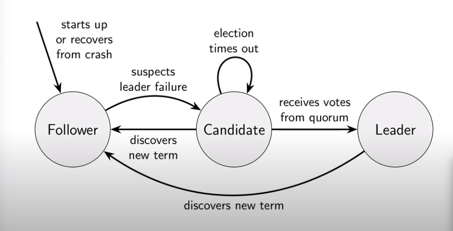
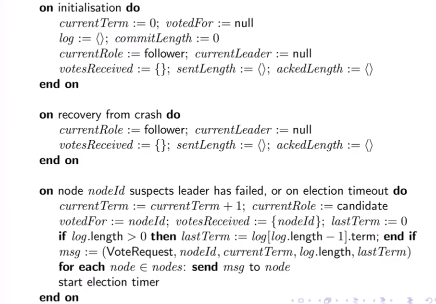
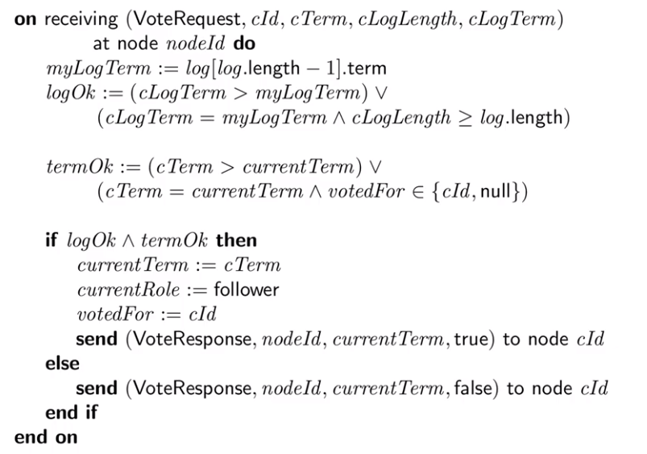
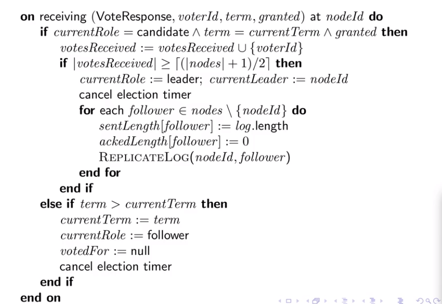
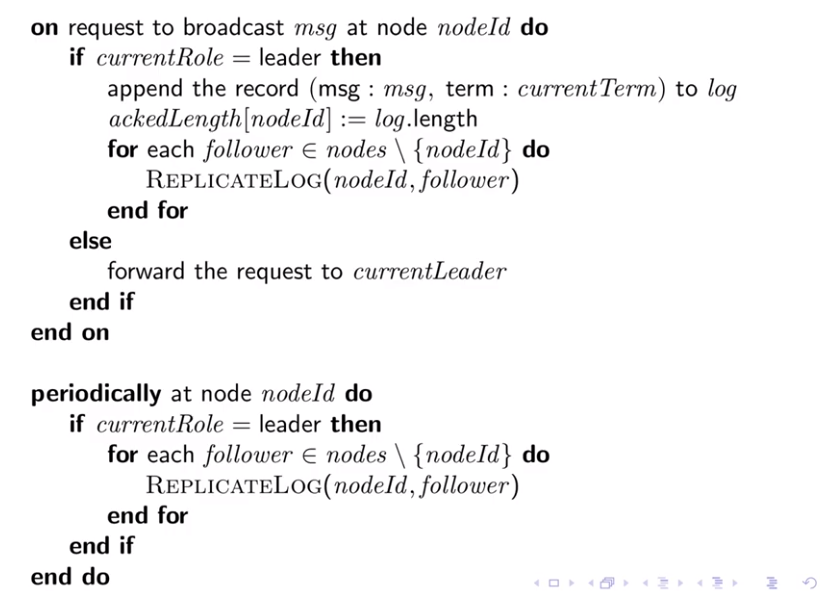
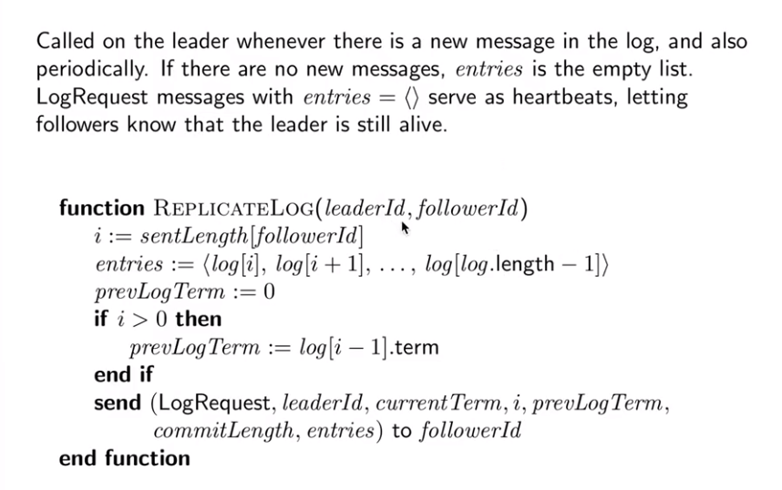
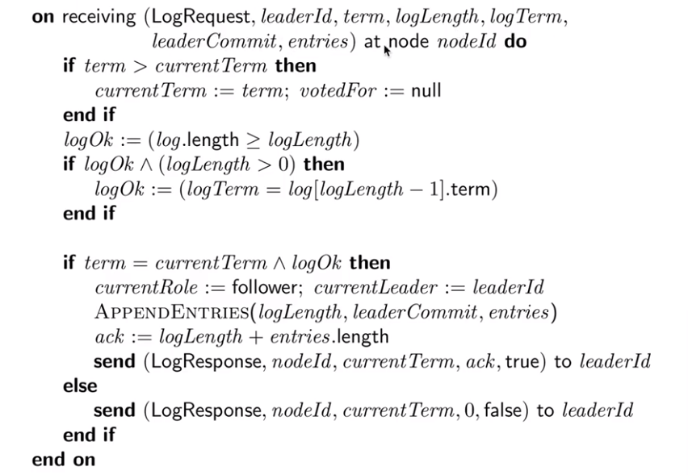
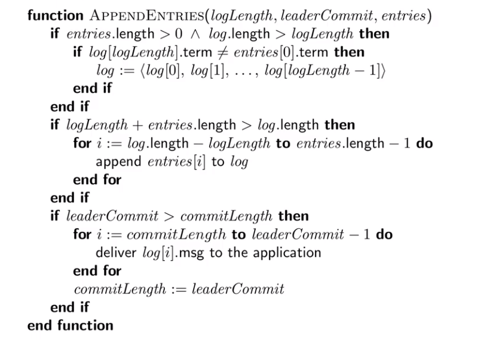
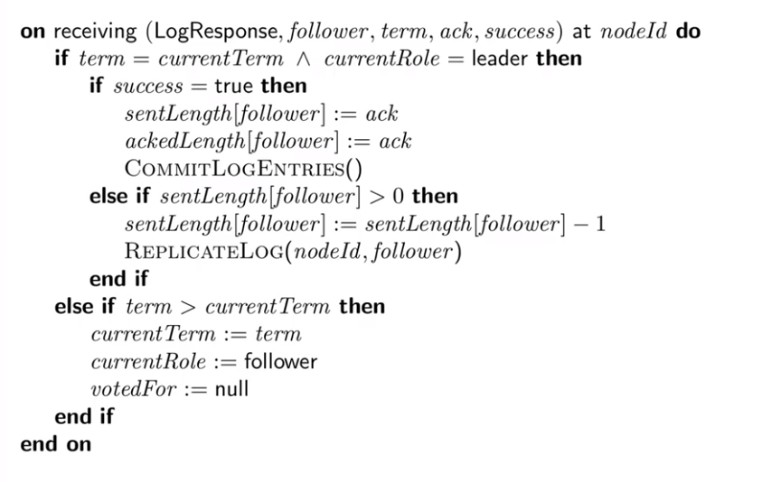

# RAFT

RAFT is a consensus algorithm

> The goal of a **distributed consensus algorithm** is to allow a set of computers to all agree on a single value that one of the nodes in the **system** proposed (as opposed to making up a random value). The challenge in doing this in a **distributed system** is that messages can be lost or machines can fail.

Basically the foundation part of RAFT is a state machine where each **node** could be in one particular state: **Leader**, **Candidate** and **Follower**.


## Node state transitions

Initially, when a node starts up, or when it crashes and restarts, it is in the follower state.

Eventually the system needs to have a leader, so in order for a node to became a leader, it has to first became a candidate; nodes became a candidate if its failure detector tells it that there is a suspected leader failure (essentially if it doesn't hear the leader for a certain period of time there's a time out where the node move into the candidate state assuming the leader is dead).

When a node becomes a candidate it asks for votes from the other nodes, and if successfully obtains a quorum of votes from other nodes, then this candidate can became a leader. It could be happen that in this phase the candidate hears about some other candidate with a higher **term number** and in this case, the candidate step back to the follower state. It could be happen also that the election ends for time out not receiving any answer from other nodes, and in this case the candidate starts a new election phase with a higher term number.

Once a node is leader it remains leader for potentially a very long time, until that node crashes, get shut down or another candidate starts a new election phase with a higher term.



> State transitions displayed

## Code

Let's start digging into the code step by step spread over nine part.


### Initialisation



During this phase we are going to initialise a bunch of variables to let the raft works properly. The first four variables **currentTerm**, **votedFor**, **log** and **commitLenght** has to be store in a persistent storage. These variables must be updated on disk before the node do anything else; this is important for the crash recovery strategy. The other five variable should be stored in memory because they are going to initialized during a recovery from crash.

- **currentTerm** is just an integer that is incremented every time a leader election happen
- **votedFor** is to ensure that the node only vote once within a particular term
- **log** is a sequence of entries, every entry in the log consists of two things: a **message** we want to deliver broadcast and the **term** of the leader at the time we broadcast. What we have to ensure is that all the nodes have the same copy of the log. This assumption could be uncertain so we have a concept of commit, in terms of, a certain piece of log from the start to a certain point will be committed so that entries are not going to change anymore.
- **commitLength** tells us how far we have committed the log entries (as we said before)

We can start evaluating the election phase: as we seen before the election phase starts if the node suspects the leader has failed or in case of election time out. In this phase the node increment currentTerm, transition to candidate and vote for itself, putting immediately the vote for itself into the list of votes received. The node compute the lastTerm putting it to zero, or in case of log not empty the terrm of the last entry in the log.  

After packaging all the gathered information into a message, a message of **VoteRequest** meaning a candidate with **nodeId** is asking for vote, and then it will be delivered to all the nodes in the cluster. 

After sending the message to all the nodes, the node start the timeout timer of the election.


### Voting a new leader



What happens to a node (nodeId is the recipient of this message) that receives this vote request for a certain candidate Id, candidate term, candidate log length and candidate log term?

First of all the node check if the local log is consistent with the candidate said: the recipient of the message get the last log entry term and compare it with the incoming values

- the log is ok if the candidate term log is greater then the own log term
- if the candidate has the same term, but the candidate log length is greater or equal to the own log length

In this way we are ensuring the candidate has an up to date log. 

We have to ensure also that we are not allowed to vote more then one candidate in a different term, and this is what **termOk** is going to do. So if the candidate term is greater the the **currentTerm** or we have not voted yet for the candidate **nodeId** or we have not voted yet for anyone. So in case the candidate term is lower then my current term is not possible to vote for.

If both are ok then we are going to vote in favour for the candidate.


### Collecting votes



Back on the candidate side to look to all responses.

We have a successful vote when the currentRole of the node is candidate, the term coming from response is equal to currentTerm and the vote is granted. So in this case first of all we have to add the **voterId** to the set of the votes we received (we have to count the unique vote). If the set of votes is a quorum (the number of votes is greater than the half of the number of the nodes round up) then we can transition to **leader** state and we can cancel the election timer because we reached the quorum of votes we need to became a leader. Becoming a leader means we have to initialize some internal state and notify all the nodes the node is the new leader.


###  Broadcasting messages



When a node receive a request the behaviour depends on the current role of the node itself. If the node is not a leader simply forward the request to the current leader and do nothing else. 

In case the node receive the message is a leader, it append the message to the log using the current term of the leaders itself; then we need to tell all the follower about the message, and to do this we are going to use the **ReplicateLog** function we seen before.

As long as the node is the leader, it periodically replicate the log to all the followers node. We can consider this function as an heart beat to let know the follower node the leader is alive. Another proposes to send this replication log periodically i because some message could be loss in the network. 

### Replicating from leader to followers



The variable **i** indicate the number of log that we already have sent to the follower. So once we have found the index i we are able to retrieve all the log entries we didn't sent to the follower, and this might be empty. We need also to get the last term before i in order to perform some consistency check to the log that we will se later. 


### Followers receiving LogRequest message



What happen when a follower receive a log request message. 

The first thing we have to do is to check the term. In case of the term coming from the message is greater than the current term we have to update the internal state in the fields of currentTerm and voteFor.

The logLength is the length of the prefix on the leader, after that we send the suffix with the entries; the logLength consists of the log entries we are not sending to the followers. We can think the log is splitted into two different parts

```
------------------------------------------------------------------------------------
|                                      |                                           |
|         PREFIX                       |            SUFFIX                         |
|                                      |                                           |
------------------------------------------------------------------------------------
                                       ^
                                   LogLength
         not sending                                  sending to
         to follower                                    follower
```

> Log

So we have to check if the follower own log is at least as as long as the prefix, because if the follower log is shorter is mean we have a gap in the log so we can't accept entries because we have missed some messages.  If the follower log is long enough  then we have to check the term, in particular we require that the **term** entry of the log at the same position of the logLength coming from leader must be the same coming from the leader. 

**In this way we can guarantee the log before logLength contains the same entries in the leader and in the follower, so the log is consistent up to the logLength point.**

In case all the checks are ok, we can append the the entries we received in the current log and response back to the leader with an acknowledge message, otherwise we have to response back with a kind of nack, indicating the leader we are inconsistent with the log.


### Updating followers' log



As we saw previously, if the log request contains a set of data that is valid for the follower, it response to the leader with an ack response and append all the log entries present in the message to the own log. Deep dive into this functionality.

First thing we have to do is to check if the log are consistent for each other. In case of the follower log term at logLength position is different from first entry term in the incoming message we have to **truncate** the log; this means that we are going to take the first portions of the log till logLength position. 

Next we want to append any new entry to log. 

Next we can notify the application all the log entries that are not committed yet by the follower, but the leader. 


### Leader receiving Log acknowledgements



this portion of code is related to the the leader receiving LogResponse from the followers.

As usual first of all we check the term in order to understand if we have to discard the message in case of term lower then current term. In case of term coming from follower greater than current term we have to move into the state of follower and reset both the current term and the voting.


